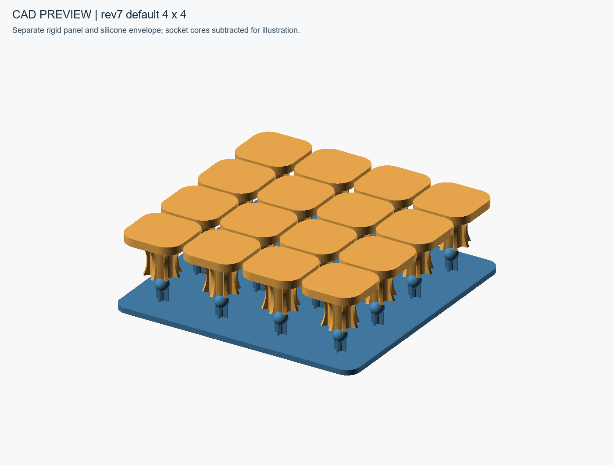
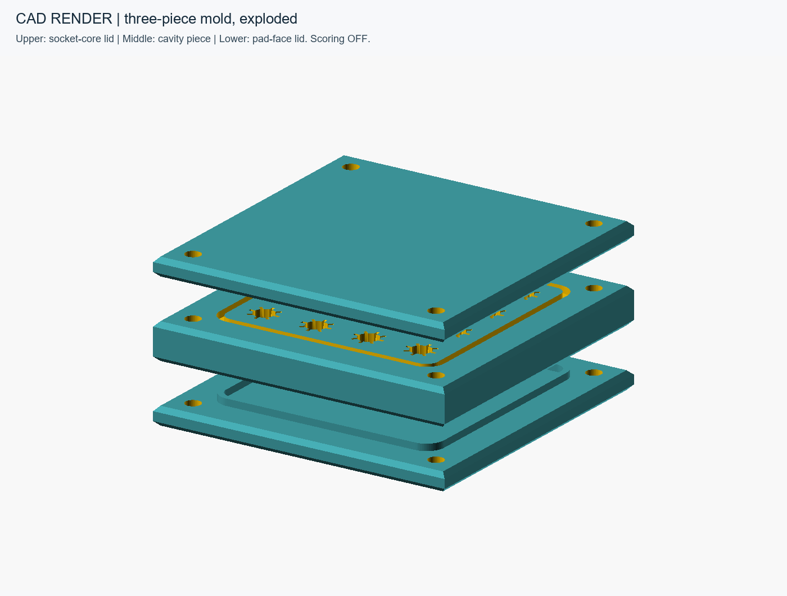
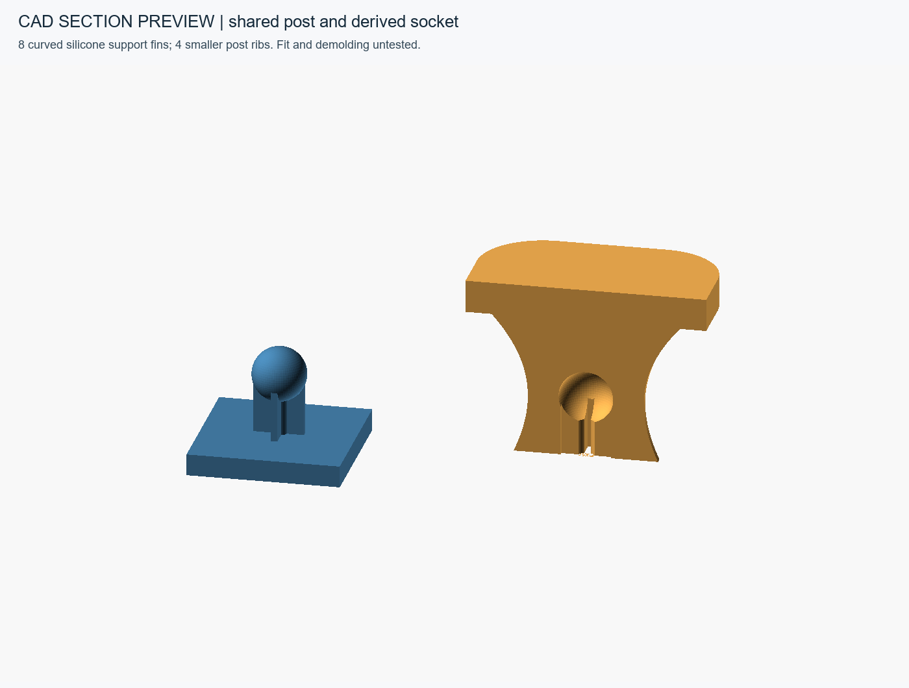

# Hoplon-Arrays

Hoplon-Arrays is a modular cable-routing and cable-management system intended to fit underneath a desk. Silicone units snap onto a separate rigid, 3D-printed panel, which mounts to the desk underside with adhesive. Each unit has a rounded-square pad, a center column, and eight curved support fins. Stem-and-ball posts on the panel have four smaller alignment ribs; matching cores on the mold lid form sockets during casting.

**0.1.0 prototype source release candidate.** This snapshot includes the rev7 source, three checked print candidates, a socketless reference and proposed build instructions. The center-piece STL is withheld because mesh checks found zero-area triangles; there is no complete cleared printable mold set yet. See the [release notes](docs/release-notes.md) for what is included and what is deferred.

The current DIY material is **Shore 40A two-part silicone**; the owner's silicone and mounting-tape links are recorded in the [build guide](docs/build-guide.md#owner-used-materials). A complete physical build record, verified printing settings, and performance test record are still missing. This is a proposed pour-and-cure workflow.

*Current-source CAD preview, shown upright with units lifted above the panel for detail; installed units face downward beneath the desk. The illustration subtracts the shared post geometry to show intended sockets. It is not a photograph or evidence of successful casting.*

## Start here

1. Read the [validation status and file inventory](docs/validation.md) before choosing files. The original root-level STLs and legacy quote package are not the matched release set.
2. Follow the [build guide](docs/build-guide.md) for materials, calculated hardware, printing checks, a small compatibility trial, and the proposed casting sequence.
3. Use the [parameter guide](docs/parameters.md) and [validation commands](docs/validation.md#reproduce-the-checks) to inspect or customize the source. Resolve the center export before treating the outputs as a complete matched set.

You will need an appropriate 3D-printing workflow, measuring tools, mold-fastening hardware, the selected silicone manufacturer's technical and safety documentation, mixing equipment, mounting adhesive, and product-appropriate protective equipment. Product compatibility and printing settings remain to be tested and documented.

## What is included

| Part | Role | Current source / export |
| --- | --- | --- |
| Rev7 parametric source | Canonical mechanical design; millimeters | [system_rev7_perforated_score.scad](system_rev7_perforated_score.scad) |
| Center mold piece | Cavities, two face grooves, four bolt holes | Source mode `center_piece`; STL withheld; see [mesh issue](docs/validation.md) |
| Socket-core lid (`top_lid`) | Ball-and-rib cores enter silicone from the column side | [top_lid.stl](exports/rev7-default/top_lid.stl) |
| Pad-face lid (`bottom_lid`) | Closes the rounded-square pad face | [bottom_lid.stl](exports/rev7-default/bottom_lid.stl) |
| Separate rigid panel | Printed base with the mating post array; never part of the casting mold | [panel.stl](exports/rev7-default/panel.stl) |
| Silicone positive | Visual/cavity-construction envelope only; **no molded socket** | [silicone_positive_reference.stl](exports/rev7-default/silicone_positive_reference.stl); see [validation](docs/validation.md) |

The listed exports are computationally checked candidates for printing trials, not physically validated tooling. Resolve the center-piece mesh issue before treating them as a complete matched mold set. The default configuration is 4 × 4 on 23.4 mm pitch, with a 94.6 mm square panel and 130.6 mm square mold footprint. Scoring/perforation code exists but is **disabled in this set**. No female receivers, carrier array, retaining clips, nut traps, or ejector blocks are required.

*CAD render: socket-core lid above the cavity piece, pad-face lid below. Seating walls enter grooves; their height is not extra closed-stack thickness.*

*Illustrative cutaway derived from the source modules. The four post ribs are distinct from the eight larger silicone support fins. Rendering does not establish fit, release, or durability.*

## Build overview

After resolving the center export and validating a complete matched set, print and inspect the three mold pieces and separate panel. Dry-fit the stack and hardware, then run a small silicone/surface/fit trial. With the pad-face lid beneath the center piece and the column openings accessible, fill before lowering the core lid. Cure according to the chosen product documentation, open the mold, carefully release the sockets, inspect/trim flash, and trial-fit units onto the panel. See the [complete proposed sequence](docs/build-guide.md), including unverified air escape and demolding limits.

The panel's flat back faces the desk underside and the silicone array faces downward. Adhesive-fitting slits in the panel back are a **planned change**, absent from the current CAD and exports; their dimensions and effect on the 2 mm panel need review. Adhesion to the actual desk finish and cable retention are not yet documented as validated.

A demonstration video is planned for a future update. It will show under-desk mounting, cable routing and adjustment, and relevant build steps; no video is available yet. See the [photo and video handoff](docs/photos.md).

## Contributing, evidence, and license

For a geometry or build report, provide the source hash, all parameter overrides, export tool version, affected mode, measurements and units, and reproducible steps. For a physical trial, include material product and batch, print/process settings, and privacy-checked photos. Distinguish source changes, preview artifacts, mesh defects, and fit observations; intentional intersections within Boolean unions are not automatically errors. Propose mechanical changes separately with before/after evidence.

Original project materials are offered under the custom [Hoplon-Arrays Personal and Noncommercial License](LICENSE.md). Personal hobby use, modification and free sharing are permitted with attribution and retained notices. **Business use, including internal business use, sales and paid manufacturing are not licensed** without separate written permission from the applicable rights holder. Third-party materials keep their own terms.

These are custom terms, not an open-source or standard Creative Commons license. Their reach depends on the rights the licensor actually holds; they do not guarantee exclusive control of functional physical parts. See [licensing scope and limitations](docs/licensing.md), and the [release checklist](docs/release-checklist.md) for outstanding publication gates.

The [photo handoff](docs/photos.md) lists the missing physical evidence and reproducible CAD images. [AGENTS.md](AGENTS.md) gives concise maintenance rules.
